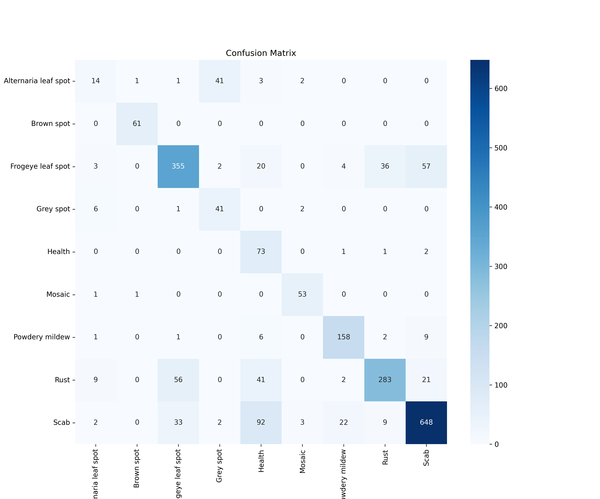

# 🍎 AI-Driven Smart Farming: Apple Leaf Disease Detection

This project applies deep learning to automatically detect multiple diseases in apple leaves using high-resolution image data. It is specifically built with farmers and agricultural applications in mind, particularly for regions like **Himachal Pradesh, India**, where apple farming is a major industry.

---

## 📊 Problem Statement

Early and accurate identification of apple leaf diseases like **Scab**, **Rust**, and **Leaf Spot** is critical for reducing crop loss and improving yield. Traditional manual inspections are time-consuming and error-prone. This project offers a fast, scalable, AI-based solution.

---

## 🎯 Objectives

- Classify apple leaf images into disease categories.
- Build a reusable inference pipeline for new leaf images.
- Create a modular ML project structure suitable for extension (e.g., yield prediction).

---

## 🗂️ Project Folder Structure

AI_Smart_Farming/
├── data/
│ └── disease_detection/
│ ├── raw/ # Original class-wise images
│ └── processed/ # (Optional) For cleaned/split images
├── models/
│ └── apple_leaf_cnn_model.h5 # Trained MobileNetV2 model
├── notebooks/
│ ├── 1_data_preprocessing.ipynb
│ ├── 2_model_training.ipynb
│ └── 3_inference.ipynb
├── outputs/
│ └── figures/
│ ├── apple_disease_training_metrics.png
│ └── confusion_matrix.png
├── requirements.txt
├── README.md
└── .gitignore

---

## 🧠 Approach

1. **Data Preprocessing**  
   - Resize to 224×224  
   - Normalize pixel values  
   - Augment with rotation, shift, zoom

2. **Model Training**  
   - Used MobileNetV2 with Transfer Learning  
   - Applied class weights to handle imbalance  
   - Fine-tuned top layers after initial training

3. **Model Evaluation**  
   - Accuracy, loss curves  
   - Confusion matrix  
   - Classification report

4. **Inference Pipeline**  
   - Upload and classify new images  
   - Show top prediction with confidence level

---

## ✅ Results

| Metric | Value |
|--------|-------|
| **Validation Accuracy** | 77.73% |
| **Model Used**          | MobileNetV2 |
| **Classes Detected**    | 9 (Diseases + Healthy) |

<details>
  <summary>📊 Confusion Matrix</summary>



</details>

<details>
  <summary>📈 Training Metrics</summary>


</details>

---

## 💡 Future Scope

- 🌾 Add Apple Yield Prediction using weather + soil data
- 🛰️ Integrate drone/satellite imagery for large-scale farms
- 📱 Deploy real-time inference via Streamlit or mobile app
- 🌐 Multilingual support for rural farmer usage

---

## 🔧 Tech Stack

- **Language:** Python 3.10  
- **Libraries:** TensorFlow, Keras, NumPy, Matplotlib, scikit-learn  
- **Model Architecture:** MobileNetV2   

---

## 🚀 Setup Instructions

```bash
# Clone the repository
git clone https://github.com/RLander-sudo/AI-Smart-Farming-AppleLeaf-Disease-Detection.git
cd AI-Smart-Farming-AppleLeaf-Disease-Detection

# Get the data and put it in the specific folder
	data/disease_detection/raw
		AppleLeaf(https://www.kaggle.com/competitions/plant-pathology-2020-fgvc7)
		images(https://github.com/JasonYangCode/AppleLeaf9)

# Create and activate virtual environment
python -m venv venv
source venv/bin/activate  # or venv\Scripts\activate on Windows

# Install dependencies
pip install -r requirements.txt

# Run Jupyter notebooks
jupyter notebook